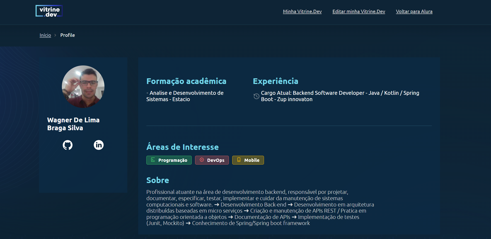

# API Gateway

* Lida com todas as solicitações e executa o roteamento dinâmico de aplicativos de microsserviço.
* Funciona como porta de entrada para todos os pedidos e pagamentos.
* Também é conhecido como Edge Server.
* Zuul é construído para permitir roteamento dinâmico, monitoramento, resiliência e segurança.
* A partir de um ponto especifico o gateway será responsavel por encontrar a melhor instancia de cada microsserviços para atender a requisição.

| :placard: Vitrine.Dev |     |
| -------------  | --- |
| :sparkles: Nome        | **API Gateway**
| :label: Tecnologias | SPRING CLOUD ROUTING
| :rocket: URL         | https://url-deploy.com.br
| :fire: Desafio     | https://www.alura.com.br/curso-online-microsservicos-implementando-java-spring

<!-- Inserir imagem com a #vitrinedev ao final do link -->

[url-vitrine-dev](https://cursos.alura.com.br/vitrinedev/wagner-sistemalima)

## Setup do Projeto
* Linguagem de programação: Java
* Tecnologia: Spring Boot 2.6.13
* Gerenciador de dependência: Maven
* Java 17
* IDE IntelJ

## Implementação utilizando as ferramentas do ecossistema Spring com Java 17
* Gateway SPRING CLOUD ROUTING: Fornece uma maneira simples, mas eficaz, de rotear para APIs e fornecer preocupações transversais a elas, como segurança, monitoramento/métricas e resiliência.